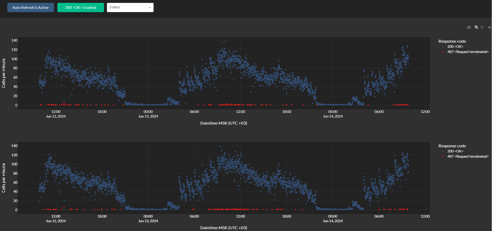

# Calls Visualizer

__Визуализация статистики вызовов телефонии (с кодами возврата)__

- используется статистика вызовов их базы данных _Clickhouse_ (парсинг звонков - проект [sip2click](https://github.com/ivan-v-ivanov/sip2click));
- для разработки web-интерфейса использован фреймворк [_Dash_](https://dash.plotly.com);
- установка проекта осуществляется через [_docker_](https://www.docker.com).

  

__Возможности системы визуализации:__
- отображение статистики по неограниченному количеству серверов на разных графиках;
- визуализация всех обнаруженных кодов возврата с расшифровкой;
- возможность отключить автообновление графиков (по умолчанию обновление происходит раз в минуту), убрать отображение `<200> OK` кода ошибки и выбрать временной интервал загрузки статистики из БД (от суток до месяца);
- интерактивное взаимодействие с графиками (зум, перемещение, удаление определенных кодов возврата).

__Содержание проекта:__
- _assets_ - файлы для flask-версии проекта (устаревшее);
- _control_ - скрипты управление docker-контейнером приложения (запуск, перезагрузка, остановка и прочее)
- _dashboard_ - библиотека с методами для web-интерфейса Dash;
- _flaskapp_ - файлы web-интерфейс первой версии, написанного на flask;
- _library_ - библиотека с общими методами (парсинг, расчет статистики, проверка коннектов и типа системы и т.д.);
- _parameters_ - содержит файлы с параметрами для docker-контейнеров.
- _webapp.py_ - описание архитектура web-интерфейса и параметры запуска сервиса.

__Запуск проекта:__
- собрать docker image `docker build -t calls-monitoring:latest`;
- скопировать содержимое папки `parameters` в директорию `/etc/calls_monitoring/parameters`;
- скопировать содержимое папки `control` в `/opt/calls_monitoring`;
- запустить программу c использованием скрипта `/opt/calls_monitoring/start.sh`.
